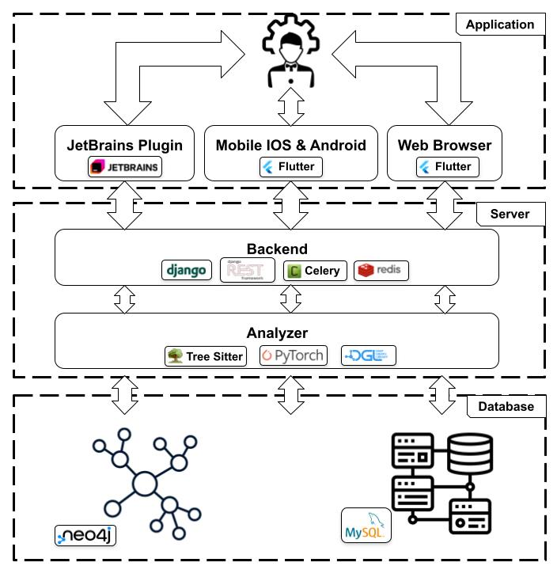
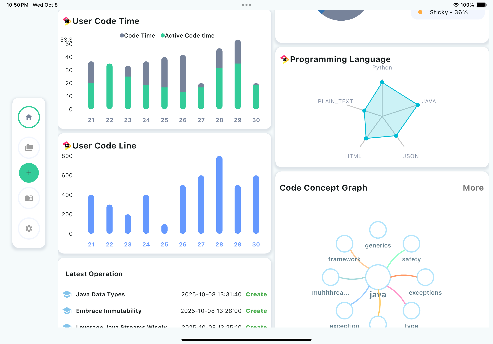
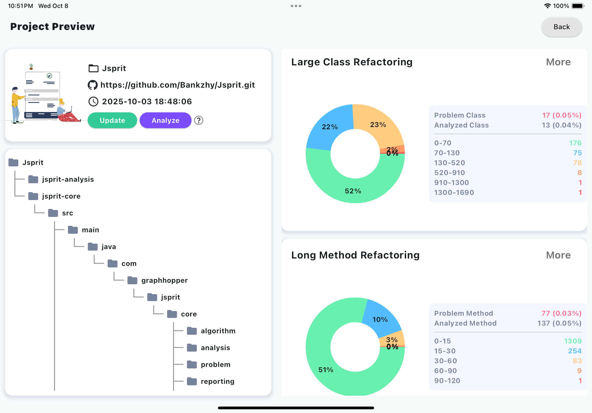
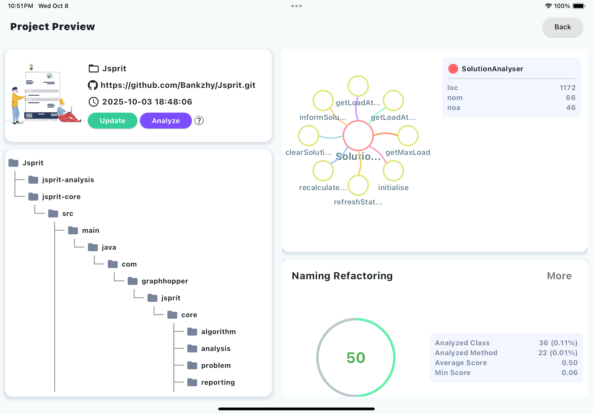
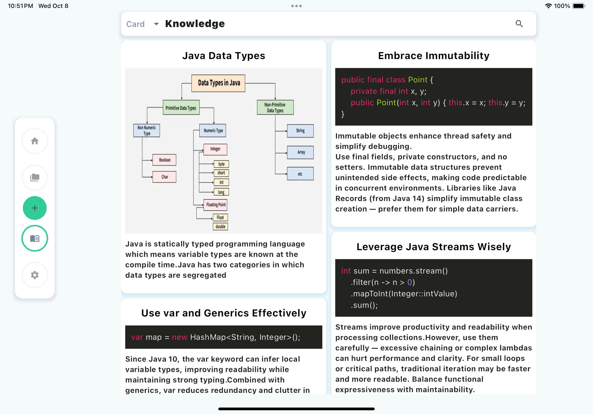

# GRAS
GRAS (Graph Refactoring Assistance System) is an assistant tool that helps developers refactor their code.

## 📖 Introduction  
This project is the implementation of the doctoral dissertation *"Software Refactoring using Graph Deep Learning"*.  
We present the core technical implementations, related papers, as well as the architecture and functionalities of the proposed tool.  

The core code will be gradually released as open source after further refinement.  
A Tool Demo can be tested at the following URL.
[Tool Demo](http://3.27.214.171/)
You may log in using **username:** `cot` and **password:** `cot`.  

## 📑 Related Paper  
- HanYu Zhang, Tomoji Kishi, *Long Method Detection Using Graph Convolutional Networks*, **Journal of Information Processing**, 2023, 31, pp. 469-477.  
- HanYu Zhang, Tomoji Kishi, *Large Class Detection Using GNNs: A Graph Based Deep Learning Approach Utilizing Three Typical GNN Model Architectures*, **IEICE Transactions on Information and Systems**, 2024, Volume E107.D, Issue 9, pp. 1140–115.  
- HanYu Zhang, Tomoji Kishi, *KG-Code: A Knowledge Graph Guided Pre-Training Approach for Code Representation* [Accepted by APSEC 2025].
- HanYu Zhang, Tomoji Kishi, *A Code Smell Refactoring Approach using GNNs* [Under Review].

## 🏗 Architecture  
The overall architecture of this tool is shown as following Diagram.

  

## ⚙️ Functions  
List the main functions provided by the tool:  

- **Naming Refactoring** – [Tool Demo] Naming refactoring aims to identify class and method names that are inappropriate or inconsistent with their corresponding code semantics.In the naming refactoring, we employ KG-Code to predict the appropriate class and method names within a project and compare them with the existing names to calculate a naming score.
- **Code Clone Refactoring** – [Under Development] Code Clone Refactoring aims to identify code  pairs that share similar functionality or structure. In this code clone refactoring, we utilize the KG-Code model to detect and analyze clone pairs within the project. 
- **Large Class Refactoring** – [Tool Demo] Large class refactoring aims to identify classes that are excessively large and contain an excessive number of methods, leading to poor modularity and maintainability.In Large class refactoring, we employ the GNN-based large class refactoring to detect and identify candidate methods for extraction.  
- **Long Method Refactoring** – [Tool Demo] Long method aims to identify methods that contain an excessive number of lines of code, which may reduce readability and maintainability. In long method refactoring, we utilized the GNN-based long method refactoring approach, to detect and identify the extract lines.
- **Feature Envy Refactoring** – [Under Development] Feature Envy refactoring aims to identify methods that should be moved to other class. In feature envy refactoring, we utilized the GNN-based feature envy refactoring approach to identify the move method opportunities.

## ✨ Features  
- **Proactive Refactoring** – GRAS automatically performs refactoring detection and provides suggestions to developers. 
- **Graph Representation Refactoring** – GRAS leverages the graph deep learning techniques to enables high refactoring performance, it visualizes both the code structure and the coding knowledge in graphical representation. 
- **Cross-Platform Refactoring** – GRAS is designed as a cross-platform refactoring system make developers can access and perform refactoring tasks seamlessly across multiple platforms.

## 🚀 Tool Demo
[Tool Demo](http://3.27.214.171/)
You may log in using **username:** `cot` and **password:** `cot`.  
<table>
  <tr>
    <td align="center"> Fig. 1: Coding Status</td>
    <td align="center"> Fig. 2: Project Refactoring</td>
    <td align="center"> Fig. 3: Project Refactoring</td>
    <td align="center"> Fig. 4: Build you knowledge</td>
  </tr>
</table>

